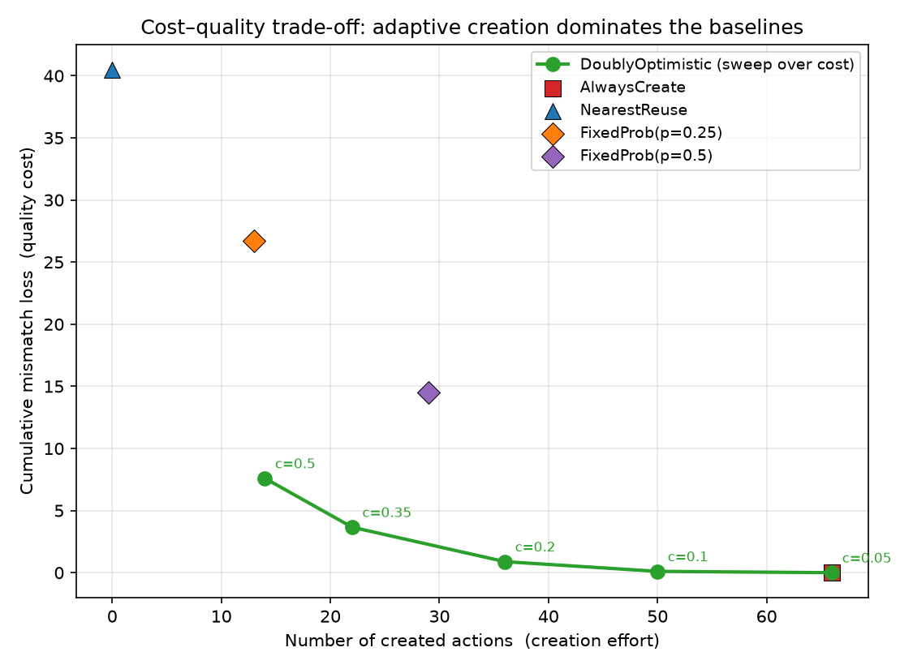
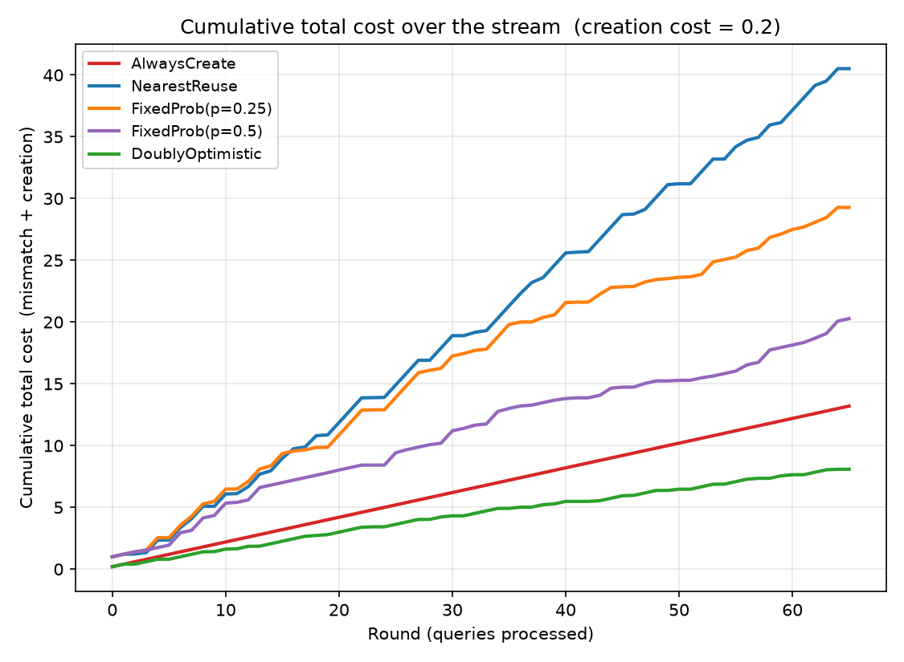
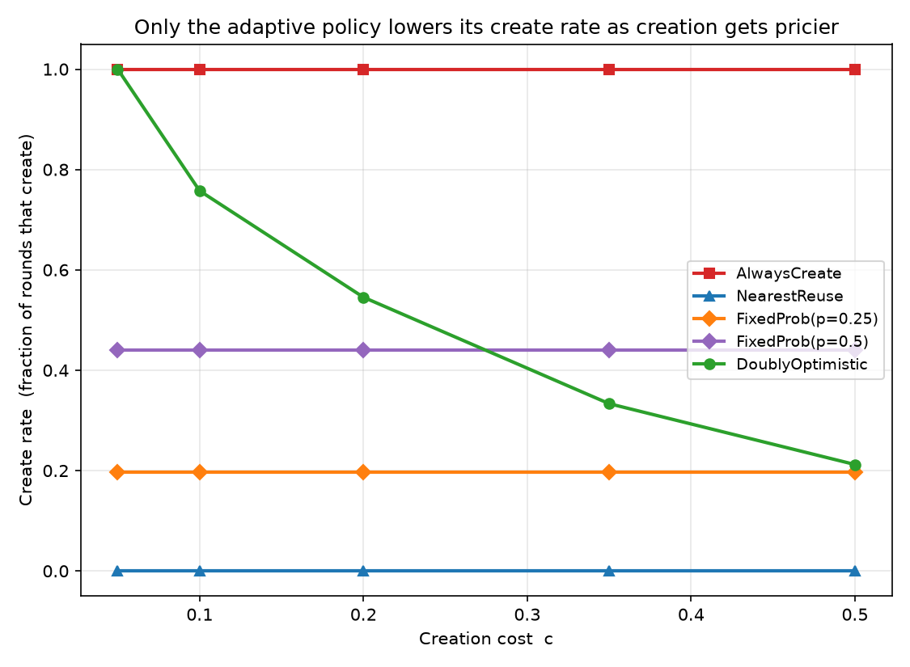
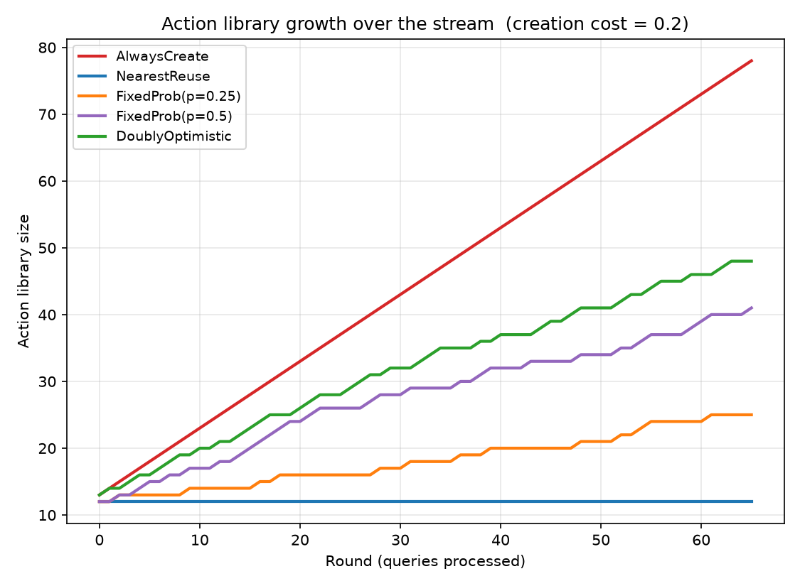

# GenAction — A Cost-Aware Create-or-Reuse Decision Agent for LLM Response Systems

> An online decision agent that, for each incoming user query, decides whether to **reuse** a stored response (cheap, but risks a mismatch) or pay a fixed cost to **create** a new, reusable response — and learns to make that trade-off well.

This is a small **research prototype**, inspired by Jianyu Xu's research direction
on *online decision making with generative action sets*, and specifically the
**create-or-reuse** setting in which an agent grows its own action set over time.
It is **not** a chatbot demo: the focus is the *decision rule* and its evaluation
as a sequential decision-making problem. The repository deliberately stays
lightweight — it runs offline, with no API keys and no large datasets, in under
five minutes on a laptop.

> **Positioning / honesty.** This project is *inspired by* the create-or-reuse
> formulation; it does **not** reproduce any specific theorem and makes **no**
> formal regret-bound claims. It implements a clean, explainable LCB/UCB-style
> policy and evaluates it empirically against sensible baselines.

---

## Motivation

Production LLM systems rarely answer every query from scratch. They maintain a
library of reusable assets — canned answers, FAQ entries, retrieval snippets,
cached generations, saved "skills" or tools — and decide, per query, whether an
existing asset is good enough or whether it is worth **paying to generate a new,
reusable one**. Creating is expensive (LLM tokens, human review, curation,
latency); reusing is cheap but a poor-fitting reuse hurts answer quality.

The catch is that the library is **endogenous**: a good creation today is an
asset that can be reused for many similar queries tomorrow. So the right policy
is not "always create" (wasteful) or "always reuse" (low quality) but an
*adaptive*, cost-aware rule that creates **where and when it pays off**. That is
exactly an online create-or-reuse problem with a *generative* (growing) action
set.

## Problem formulation

At round $t = 1, \dots, T$:

1. a query (context) $x_t$ arrives;
2. the agent holds an action library $\mathcal{A}_t$ (each action = a stored
   response with a canonical query and category);
3. the agent either
   - **REUSE**s an action $a_i \in \mathcal{A}_t$, incurring mismatch loss
     $\ell(x_t, a_i) \in [0, 1]$, leaving $\mathcal{A}_{t+1} = \mathcal{A}_t$; or
   - **CREATE**s a new action $a_\text{new}$ from the gold response for $x_t$,
     paying a fixed creation cost $c$, and setting
     $\mathcal{A}_{t+1} = \mathcal{A}_t \cup \{a_\text{new}\}$ — reusable from
     $t+1$ on.

Per-round cost:

$$
\text{cost}_t =
\begin{cases}
\ell(x_t, a_i) & \text{if REUSE } a_i,\\
c & \text{if CREATE.}
\end{cases}
$$

Objective: minimise the cumulative cost $\sum_{t=1}^{T} \text{cost}_t$.

**Mismatch loss.** Reusing action $a$ for query $x$ costs

$$
\ell(x,a) = \mathrm{clip}\Big( \underbrace{d(x,a)^{\gamma}}_{\text{semantic}} +
\underbrace{\lambda \cdot \mathbb{1}[\,\mathrm{cat}(x)\neq \mathrm{cat}(a)\,]}_{\text{category}} + \varepsilon,\; 0, 1\Big),
$$

where $d(x,a)$ is the embedding (cosine) distance between the query and the
action's canonical query, $\gamma$ makes the loss convex in distance (small
mismatches barely hurt, large ones hurt a lot), $\lambda$ penalises wrong-intent
reuse, and $\varepsilon$ is small observation noise. **A policy can always
measure $d(x,a)$, but it does not observe the category penalty or the noise
before acting** — those are only revealed through the realised loss after a
reuse. This information gap is what makes online estimation meaningful.

## Algorithm overview

Four policies are implemented (see [`src/genaction/policies/`](src/genaction/policies)):

| Policy | Rule | Role |
| --- | --- | --- |
| `AlwaysCreate` | create every round | quality ceiling, cost floor-breaker (mismatch = 0, pays $c$ every round) |
| `NearestReuse` | reuse nearest action; never create | cheap baseline; quality limited by initial coverage |
| `FixedProbability(p)` | create w.p. $p$, else reuse nearest | **cost-unaware** stochastic foil |
| **`DoublyOptimistic`** | LCB selection + UCB creation test | the adaptive method |

**The Doubly Optimistic policy.** For the current query and each action $a_i$ it
forms a small Bayesian-style estimate of the reuse loss,

$$
\mu_i = \frac{k_0\,\pi_i + \sum_j w_{ij}\,\ell_{ij}}{k_0 + \sum_j w_{ij}}, \qquad
\sigma_i = \frac{\sigma_0}{\sqrt{k_0 + \sum_j w_{ij}}},
$$

where $\pi_i = d(x,a_i)^{\text{prior\_power}}$ is the distance-based prior,
$\ell_{ij}$ are previously observed reuse losses of $a_i$ weighted by a Gaussian
kernel $w_{ij}$ on how similar their queries were to $x$, and $k_0 =$
`min_observations` is a prior pseudo-count. It then uses **two** confidence
bounds:

1. **Optimistic selection (LCB).** pick $i^\star = \arg\min_i\, (\mu_i - \alpha\,\sigma_i)$ — give under-observed actions the benefit of the doubt.
2. **Confidence-aware creation (UCB).** **CREATE** iff $\mu_{i^\star} + \beta\,\sigma_{i^\star} > c$ — i.e. reuse only when we are confident the best candidate beats paying for a guaranteed-good new action.

Intuitively: **create when reuse is either expected to be poor (high $\mu$) or
too uncertain to trust (high $\sigma$) relative to the creation cost $c$.**
Uncertainty $\sigma_i$ shrinks as similar queries are observed, so the agent
commits to reuse once it has enough relevant experience.

Tunable parameters: `alpha_lcb`, `beta_ucb`, `min_observations`,
`distance_bandwidth`, `sigma0`, `prior_power`, `creation_cost`.

## How to run

```bash
# 1. install core dependencies (offline-friendly; no API keys)
pip install -r requirements.txt        # or:  pip install -e ".[dev]"

# 2. run the test suite
python -m pytest                        # 17 tests

# 3. reproduce the experiments and figures
python scripts/run_experiments.py       # -> results/experiment_results.csv
python scripts/make_plots.py            # -> results/*.png

# 4. (optional) regenerate the sample dataset
python scripts/make_dataset.py

# 5. (optional) interactive demo
pip install streamlit
streamlit run app/streamlit_demo.py
```

Everything is reproducible from a fixed seed and uses a deterministic TF-IDF
embedding backend by default. If `sentence-transformers` is installed it is used
automatically (`--backend auto`); otherwise the project falls back to TF-IDF.

## Experiment results

All policies are run across `creation_cost ∈ {0.05, 0.10, 0.20, 0.35, 0.50}` on a
66-query support stream with a 12-entry seed FAQ library. **Average total cost
per query** (lower is better):

| policy | c=0.05 | c=0.10 | c=0.20 | c=0.35 | c=0.50 |
| --- | ---: | ---: | ---: | ---: | ---: |
| NearestReuse | 0.614 | 0.614 | 0.614 | 0.614 | 0.614 |
| FixedProb(p=0.25) | 0.414 | 0.424 | 0.444 | 0.473 | 0.503 |
| FixedProb(p=0.5) | 0.241 | 0.263 | 0.307 | 0.373 | 0.439 |
| AlwaysCreate | 0.050 | 0.100 | 0.200 | 0.350 | 0.500 |
| **DoublyOptimistic** | **0.050** | **0.077** | **0.123** | **0.172** | **0.221** |

The adaptive policy is best at **every** creation cost. When creation is nearly
free ($c=0.05$) it correctly behaves like `AlwaysCreate`; as creation gets
pricier its advantage over the best baseline grows from **~23%** ($c=0.10$) to
**~50%** ($c\geq0.35$), because it shifts from create-heavy to reuse-heavy by
creating *only where reuse is risky*. Its create rate falls smoothly with cost
($1.00 \to 0.76 \to 0.55 \to 0.33 \to 0.21$) while every baseline's create rate
is flat. Results are essentially deterministic across seeds (std of avg-loss
≈ 0.001).

## Example plots

**Cost–quality trade-off (the headline figure).** Each green point is the
adaptive policy at one creation cost; together they trace a frontier that hugs
the lower-left (low creation effort *and* low mismatch loss), dominating every
baseline.



| Cumulative cost over the stream | Create rate vs. creation cost |
| --- | --- |
|  |  |



## Why this matters for GenAI decision systems

The create-or-reuse decision is everywhere in applied GenAI: response/semantic
caching, retrieval-vs-generate routing, FAQ/macro suggestion in support tooling,
tool or "skill" synthesis in agents, and curation of prompt/answer libraries.
In all of these, generating a reusable asset has a real price and the asset
library is something the system *grows itself*. Treating this as a principled
**online decision problem** — rather than a fixed similarity threshold — lets the
system spend its (token/compute/human-review) budget where it actually improves
quality, and adapt as that budget's price changes.

## Connection to online learning / create-or-reuse decision-making

The setting combines several classic ingredients:

- **Sequential decision-making under uncertainty.** Each round is a choice with
  partial feedback (we only learn an action's reuse loss by reusing it),
  echoing the explore/exploit structure of bandits.
- **Optimism in the face of uncertainty.** LCB-based selection is the
  loss-minimisation analogue of UCB exploration: act as if reuse could be as
  good as plausibly possible, which naturally probes under-observed actions.
- **A cost-aware stopping/creation rule.** The UCB-vs-$c$ test is a confidence
  threshold for "is reuse trustworthy enough, or should I pay to create?".
- **A generative (endogenous, growing) action set.** Unlike standard bandits
  with a fixed arm set, creating *adds an arm*, and that arm is tailored to a
  region of query space — the defining feature of the create-or-reuse problem.

## Limitations and approximations

- **Not a theorem.** No regret bound is proven; the LCB/UCB rule is *inspired by*
  optimism-based methods, evaluated empirically only.
- **Semi-online embeddings.** The TF-IDF vocabulary is fit once on the known
  corpus; a fully online system would update embeddings as new text arrives.
- **Synthetic loss model.** Mismatch loss is a calibrated proxy
  (convex distance + category penalty + noise), not human judgements. The convex
  `prior_power` is the policy's modelling assumption; the method still beats all
  baselines when this is mis-specified (e.g. linear, `prior_power=1`), so the
  result is not an artefact of the policy "knowing" the loss.
- **Small, curated dataset.** ~12 FAQ + 66 stream rows, designed to make the
  coverage trade-off legible; not a benchmark.
- **Greedy creation.** Creating uses the gold response; there is no modelling of
  generation quality/variance, deduplication, or library eviction.

## Future work

- Plug in a real public customer-support corpus (see
  [`scripts/make_dataset.py`](scripts/make_dataset.py) for the data contract:
  just provide `category, query_text, gold_response`) and sentence-transformer
  embeddings (`pip install ".[embeddings]"`).
- Library hygiene: deduplicate near-identical created actions, and add eviction
  (a budgeted/finite library) — a knapsack-flavoured extension.
- A formal analysis of the create-or-reuse regret against a best-fixed-library
  comparator, and tuning of $\alpha, \beta$ to a target create rate.
- Non-stationary streams (drifting intents) where past observations should be
  down-weighted over time.

## Repository structure

```
genaction-create-or-reuse/
├── README.md                  · this file
├── research_note.md           · the theory intuition write-up
├── requirements.txt           · pyproject.toml
├── data/                      · sample_faq_library.csv, sample_stream.csv
├── src/genaction/
│   ├── embeddings.py          · sentence-transformers / TF-IDF backends
│   ├── environment.py         · the online create-or-reuse environment
│   ├── loss.py                · mismatch-loss model
│   ├── evaluation.py          · episode runner + metrics
│   └── policies/              · always_create, nearest_reuse,
│                                fixed_probability, doubly_optimistic
├── scripts/                   · make_dataset, run_experiments, make_plots
├── notebooks/                 · 01_dataset_preview, 02_run_experiments
├── results/                   · generated figures + summary CSV
├── app/streamlit_demo.py      · interactive demo
└── tests/                     · environment + policy + pipeline tests
```

## License

Released under the MIT License (see `pyproject.toml`).
